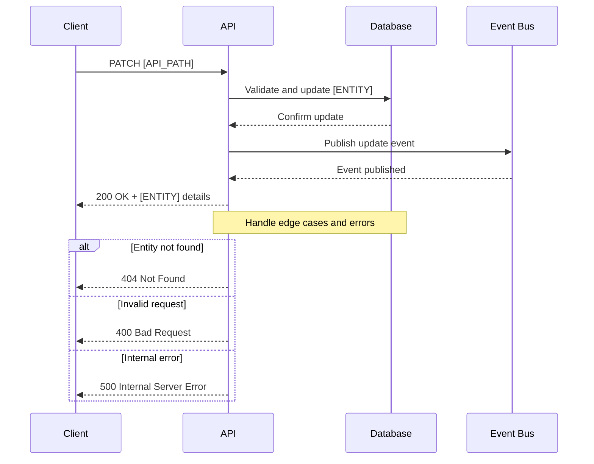

## Objective

**As** a [ROLE],  
**I want** to [ACTION],  
**So that** [BUSINESS VALUE].

## Scenarios:

### Happy Flow

```gherkin
Scenario: Successfully [ACTION] using [IDENTIFIER]
  Given I have a valid [IDENTIFIER] "[VALUE]"
  And I have a valid [FIELD] "[NEW_VALUE]"
  When I make a [HTTP_METHOD] request to update the [ENTITY]
  Then the system should return the [ENTITY] details with status code 200 OK
    And the [ENTITY] details should contain:
      | field              | value                  |
      | [FIELD_1]         | [VALUE_1]              |
      | [FIELD_2]         | [VALUE_2]              |
```

### Corner Cases

```gherkin
Scenario: Attempt to update [ENTITY] with [INVALID_CONDITION]
  Given that a [ENTITY] with [FIELD] "[VALUE]" already exists
  When I try to update a [ENTITY] with [FIELD] "[VALUE]"
  Then the system should return error 409 Conflict
    And error code [ERROR_CODE]
    And reason [ERROR_REASON]
    And a message indicating that [ERROR_MESSAGE]
```

---

## Entities and Domains Schemas

#### Entity: [ENTITY]

| Field | Type | Description |
|-------|------|-------------|
| entity_id | String | Unique identifier of the [ENTITY]. |
| entity_type | String | Entity type (enum), defined as "[ENTITY_TYPE]". |
| external_entity_id | String | External identifier of the [ENTITY]. |
| urn | String | Unique resource identifier. |
| name | String | Name of the [ENTITY]. |
| description | String | Detailed description of the [ENTITY]. |
| created_at | DateTime | Creation timestamp. |
| updated_at | DateTime | Last update timestamp. |
| metadata | Json Object | Metadata information in key-value format. |
| version | Integer | Versioning for updates. |

---

## Endpoint:

### Request

**HTTP Method:** `[HTTP_METHOD]`  
**Path:** `[API_PATH]`

#### Headers:

| Field | Type | Required | Description |
|-------|------|-----------|-------------|
| Accept | string | false | Expected response format. |
| Content-Type | string | false | Request payload format. |
| X-Trace-Id | string | true | Unique identifier for tracing. |

#### Payload: 

```json
{
  "name": "[NEW_NAME]", // optional
  "description": "[NEW_DESCRIPTION]", // optional
  "external_entity_id": "[NEW_EXTERNAL_ID]", // optional
  "metadata": { // optional
    "key1": "value1",  
    "key2": "value2"  
  }
}
```

### Response:

#### Status Codes:

***Success***
- 200 (OK)

***Client Failure***
- 400 (BadRequest)  
- 404 (NotFound)  
- 409 (Conflict)  

***Internal Failure***
- 500 (Internal Server Error)  
- 503 (Service Unavailable)  

#### Payload Schema

#### Success:

```json
{
  "entity_id": "[ENTITY_ID]",
  "entity_type": "[ENTITY_TYPE]",
  "name": "[NAME]",
  "description": "[DESCRIPTION]",
  "created_at": "[CREATED_AT]",
  "updated_at": "[UPDATED_AT]",
  "version": 1,
  "metadata": {
    "key1": "value1"
  }
}
```

#### Error:

```json
{
  "errors": [
    {
      "code": "[ERROR_CODE]",
      "reason": "[ERROR_REASON]",
      "message": "[ERROR_MESSAGE]"
    }
  ]
}
```

---

## Metrics:

### Business Metrics
- Success rate for [ENTITY] updates
- Total number of update attempts
- Error distribution by type

### Performance Metrics
- Request latency (p50, p90, p99)
- Database response time
- Event processing latency

### Infrastructure Metrics
- CPU usage
- Memory usage
- Error rate (%)

---

## Sequence Diagram



---

## References

